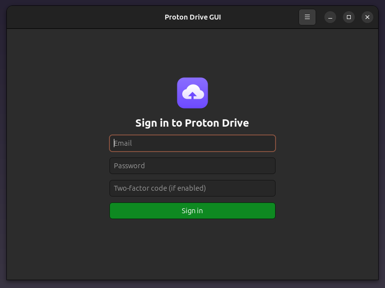

<div align="center">

<a href="https://github.com/effjy/protondrive-gui/"></a>


</div>

A native **C++ / GTK4** desktop client for [Proton Drive](https://proton.me/drive),
the end-to-end encrypted cloud storage service. Sign in to your Proton account,
browse your folders, and upload or download files — everything is encrypted and
decrypted **locally** on your machine.

Author: **Jean-Francois Lachance-Caumartin**
Credits: **Proton AG** (for the open documentation of the Drive protocol and the
GopenPGP library).

## Screenshot



## Features

- Secure **SRP** login (Proton's custom SRP-6a + bcrypt), including two-factor
  (TOTP) codes
- The full OpenPGP **key hierarchy** is unlocked locally:
  user keys → address keys → share key → folder/file node keys
- Browse folders with back / refresh navigation; file and folder names are
  **decrypted locally**
- **Download** the selected file to any location, decrypting every 4 MB block
- **Upload** a local file into the current folder (new node key, signed content
  session key, encrypted blocks and a committed manifest signature)
- **Trash** the selected file or folder (move to the Proton Drive recycle bin)
- **Empty Trash** to permanently delete trashed items
- Global application icon and About dialog

## How the cryptography works

Proton Drive's authentication and key handling are far more involved than a
password hash. This client implements them faithfully:

- **Login** uses Proton's SRP variant: the modulus is a clear-signed PGP message
  whose signature is verified against Proton's embedded key, the password is run
  through **bcrypt** (`$2y$`, the `crypt(3)` implementation), and the SRP proofs
  are computed with OpenSSL big-number arithmetic. The password never leaves your
  machine.
- The **key hierarchy** and all **metadata** (names, passphrases, tokens) are
  decrypted with [librnp](https://www.rnpgp.org/) (RNP).
- **File content** uses Proton's newer content format (an RFC 9580 v6 key packet
  addressing a v4 key, with AES-GCM SEIPDv2). Most OpenPGP libraries reject this
  transitional mix, so content encryption/decryption (and the upload-side
  key/signature generation) is handled by a tiny bundled helper, **`pdg-helper`**,
  built with Proton's own **GopenPGP** / **go-proton-api**.

## 1. Install the prerequisites

The GUI and client are C++17; the content-crypto helper is a small Go program.
You therefore need a C++17 compiler, GNU `make`, `pkg-config`, the **Go** toolchain
(**1.22 or newer**), and the development packages listed below.

| Dependency | Why it is needed |
|------------|------------------|
| `g++` / `make` / `pkg-config` | Build the C++ GUI and client |
| **GTK 4** (`gtk4`) | The desktop user interface |
| **libcurl** | HTTPS requests to the Proton Drive API |
| **OpenSSL** (`libcrypto`) | SRP big-number math and hashing |
| **librnp** (RNP) | OpenPGP key hierarchy + metadata decryption |
| **libcrypt** (libxcrypt) | bcrypt (`$2y$`) for Proton's SRP / key passwords |
| **Go ≥ 1.22** | Builds `pdg-helper` (Proton's GopenPGP content format) |

### Debian / Ubuntu

```sh
sudo apt update
sudo apt install build-essential pkg-config golang-go \
    libgtk-4-dev libcurl4-openssl-dev libssl-dev librnp-dev libcrypt-dev
```

### Fedora

```sh
sudo dnf install gcc-c++ make pkgconf-pkg-config golang \
    gtk4-devel libcurl-devel openssl-devel librnp-devel libxcrypt-devel
```

### Arch Linux

```sh
sudo pacman -S base-devel pkgconf go gtk4 curl openssl rnp libxcrypt
```

> **Notes**
> - The JSON parser ([nlohmann/json](https://github.com/nlohmann/json)) is vendored
>   in `src/vendor/json.hpp`, so no extra package is required for it.
> - On the **first** `make`, the Go helper downloads its modules
>   (`github.com/ProtonMail/gopenpgp` and friends), so an internet connection is
>   required that one time. Afterwards the build is fully offline.
> - `librnp` must be a real package; if your distro lacks it, build RNP from
>   <https://www.rnpgp.org/>.

## 2. Compile and install

```sh
make                 # builds ./protondrive-gui and helper/pdg-helper
sudo make install    # installs both binaries, the icon and .desktop entry
```

`make install` places:

| File | Destination |
|------|-------------|
| `protondrive-gui` binary | `/usr/local/bin/` |
| `pdg-helper` helper | `/usr/local/bin/` |
| `io.github.jflc.ProtonDriveGUI.desktop` | `/usr/local/share/applications/` |
| `io.github.jflc.ProtonDriveGUI.svg` (icon) | `/usr/local/share/icons/hicolor/scalable/apps/` |

Override the prefix with e.g. `sudo make install PREFIX=/usr`. To remove
everything: `sudo make uninstall`.

> If you run the program without installing it, set
> `PDG_DECRYPT_HELPER=$PWD/helper/pdg-helper` so it can find the helper.

## 3. Use the program

Launch **Proton Drive GUI** from your applications menu, or run `protondrive-gui`.

1. **Sign in** with your Proton email and password. If you have two-factor
   authentication enabled, enter the current code as well.
2. **Browse** your files. Double-click a folder to open it; use the
   **Back** and **Refresh** buttons to navigate.
3. **Select** a file by clicking it once, then use a toolbar action.

### Toolbar

| Button | Action |
|--------|--------|
| ◀ Back | Go up to the parent folder |
| ⟳ Refresh | Reload the current folder |
| ⬇ Download | Save the selected file to your computer |
| ➤ Upload | Upload a file into the current folder |
| ✕ Trash | Move the selected file/folder to the Proton Drive trash |
| 🗑 Empty Trash | Permanently delete everything in the trash |

You can sign out or open the About dialog from the **☰ menu** in the title bar.

## Project layout

```
src/proton_crypto.{hpp,cpp}   SRP, bcrypt, and the librnp OpenPGP keyring
src/proton_client.{hpp,cpp}   Proton Drive HTTP API client and key hierarchy
src/main.cpp                  GTK4 user interface
src/vendor/json.hpp           Vendored nlohmann/json
helper/main.go                pdg-helper: GopenPGP decrypt + upload helper
data/                         Application icon and .desktop entry
Makefile                      Build / install / uninstall
```

## Future work

- **Persist the session** — securely cache the access/refresh tokens.
- **Rename / move / create folder** — the API endpoints are already siblings of
  the ones used here (`/drive/shares/{id}/links/{id}/move`, `.../folders`).
- **Native content decryption** — drop the helper once `librnp` ships RFC 9580
  support for Proton's transitional packet format.

## Security note

Your password never leaves your machine in plaintext: it is run through Proton's
SRP (bcrypt + SRP-6a) and only the derived proof is sent to the server. File
contents, names and keys are decrypted locally from your address keys.

This is an independent, unofficial client and is not affiliated with Proton AG.

## License

Released under the **MIT License**.
